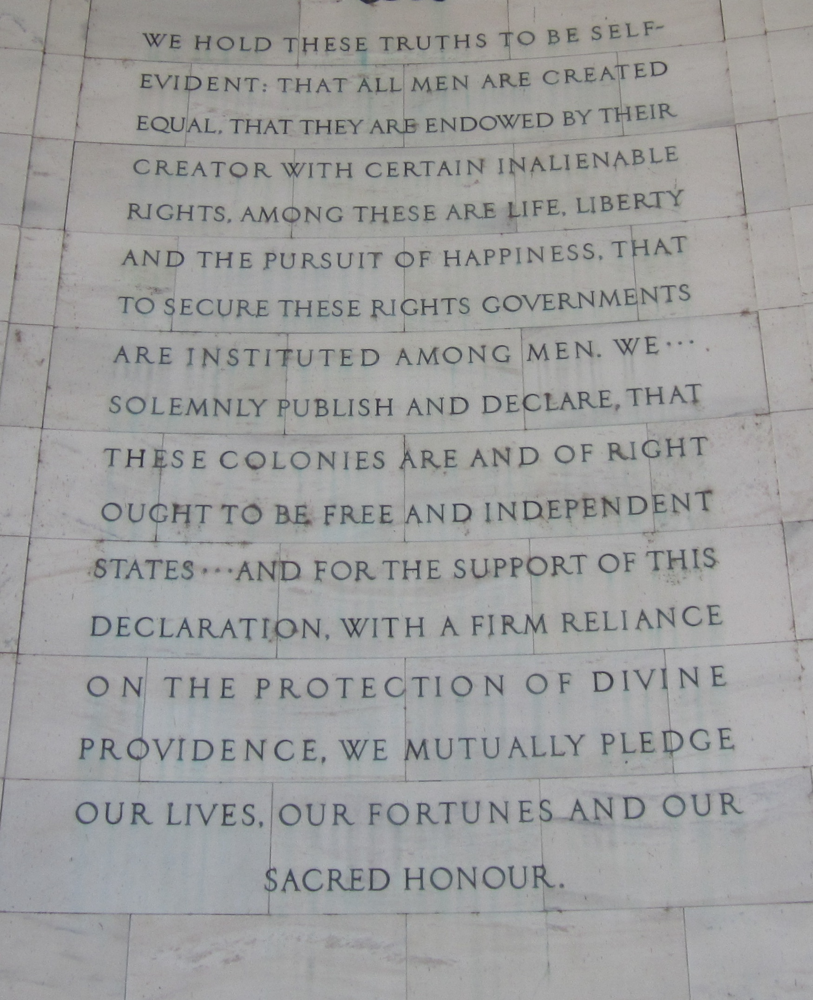
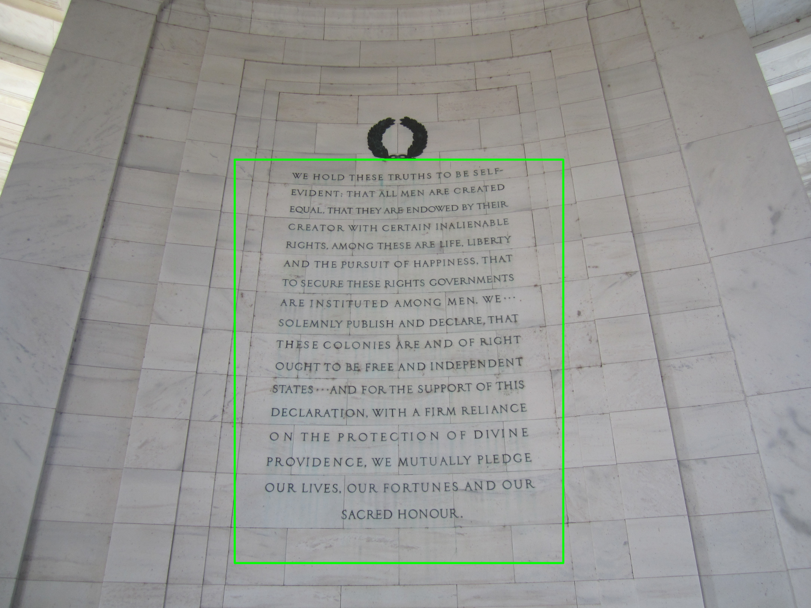
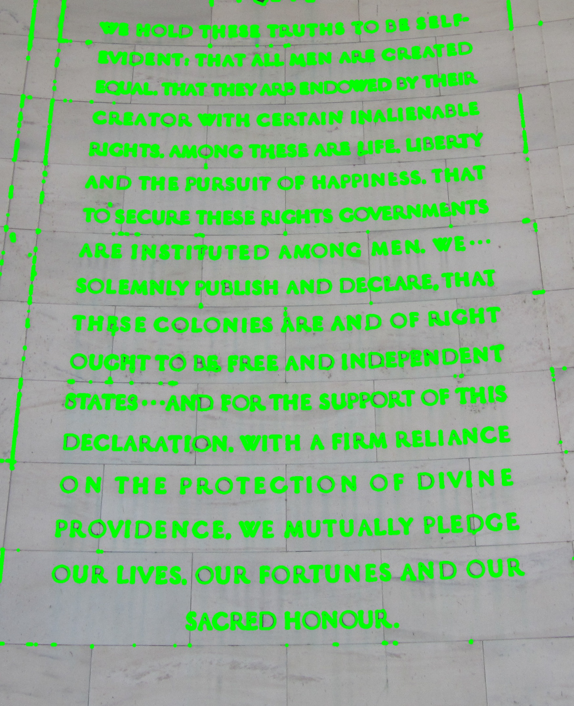

---
output:
  word_document: default
  html_document: default
---
Assignment 3 - Edge Detection 
==============================
**Peter Thramkrongart and Jakub Raszka**

##	Github link

Link to the repository: https://github.com/JakubR12/cds-visual.git

Link to the assignment folder: https://github.com/JakubR12/cds-visual/tree/main/assignments/assignment-3

## Contribution

Both Peter Thramkrongart and Jakub Raszka contributed equally to every stage of this project from initial conception and implementation, through the production of the final output and structuring of the repository. (50/50%)

##  Description

The purpose of this assignment is to use computer vision to extract specific features from images. In particular, we're going to see if we can find text. We are not interested in finding whole words right now; we'll look at how to find whole words in a coming class. For now, we only want to find language-like objects, such as letters and punctuation. 

The instructions are:

- Draw a green rectangular box to show a region of interest (ROI) around the main body of text in the middle of the image. Save this as __image_with_ROI.jpg__.

-	Crop the original image to create a new image containing only the ROI in the rectangle. Save this as __image_cropped.jpg__.

-	Using this cropped image, use Canny edge detection to 'find' every letter in the image

-	Draw a green contour around each letter in the cropped image. Save this as __image_letters.jpg__


## Methods

The problem at hand concerns finding a text in an image. In order to do so, we first cropped the image to obtain only a text part of the image. Secondly, we transformed the image into a grayscale, used a median blur with a manually set threshold to achieve the best result. The contours of text were found by canny edge detection and colored green.

## Results

We managed to highlight text in a given picture using computer vision. However, as can be seen, the result is far from perfect. Some of the brick interstices were picked up along with the text. Also, the approach relies on manual cropping and the blur parameters are hardly generalizable outside this assignment. Using object-character recognition, such as Tesseract along with a smart pre-processing and natural language processing software to predict the most plausible outcome would yield much better accuracy. 

Here are the images:

{width=200}
{width=200}
{width=200}

## Reproducibility

**Step 1: Clone repository**  
- open a linux terminal
- Navigate the destination of the repository
- run the following command  
```console
 git clone https://github.com/JakubR12/cds-visual.git
``` 

**step 2: Run bash script:**  
- Navigate to the folder "assignment-3".  
```console
cd assignments/assignment-3
```  
- We have written ad _edge_detection.sh_ to set up a virtual environment, run the python script, save the images, and kill the environment afterwards:  
```console
bash edge_detection.sh
```  

## Running the project on something else than Linux
Our projects are mainly made for Linux/mac users. Our python scripts should run on any machine, though our bash scripts may not work. For this case, we recommend using the python distribution system from https://www.anaconda.com/ to setup environments using our requirements.txt files.

