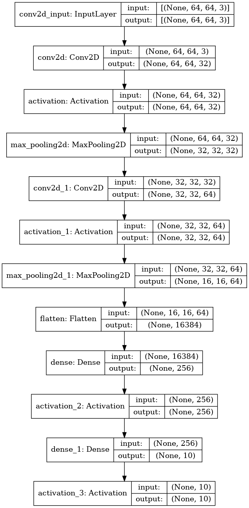
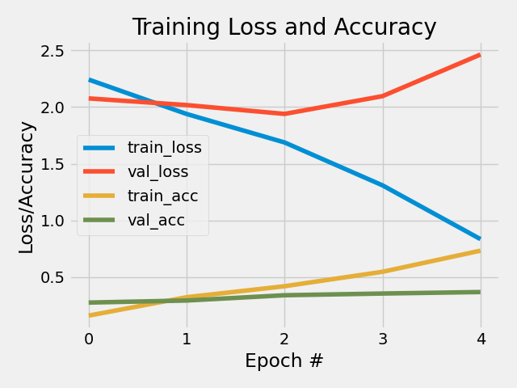

Assignment 5 - CNNs on cultural image data
==============================
**Peter Thramkrongart and Jakub Raszka**

##	Github link

Link to the repository: https://github.com/JakubR12/cds-visual-portfolio.git

Link to the asssignment folder: https://github.com/JakubR12/cds-visual-portfolio/tree/main/assignments/assignment-5

## Contribution

Both Peter Thramkrongart and Jakub Raszka contributed equally to every stage of this project from initial conception and implementation, through the production of the final output and structuring of the repository. (50/50%)

##  Description

So far in class, we've been working with 'toy' datasets - handwriting, cats, dogs, and so on. However, this course is on the application of computer vision and deep learning to cultural data. This week, your assignment is to use what you've learned so far to build a classifier which can predict artists from paintings.

You can find the data for the assignment here: https://www.kaggle.com/delayedkarma/impressionist-classifier-data
Using this data, you should build a deep learning model using convolutional neural networks which classify paintings by their respective artists. Why might we want to do this? Well, consider the scenario where we have found a new, never-before-seen painting which is claimed to be the artist Renoir. An accurate predictive model could be useful here for art historians and archivists!

For this assignment, you can use the CNN code we looked at in class, such as the ShallowNet architecture or LeNet. You are also welcome to build your own model, if you dare - I recommend against doing this.

You'll also need to think about how to get the images into an array for the model and how to extract 'labels' from filenames for use in the classification report


## Methods

The data were obtained from Kaggle (the link above). It consisted of around 5000 images from 10 different impressionistic artists. For this problem we choose to use the Keras ImageDataGenerator() class to load, rescale to 0-1, and resize the images to 64X64 pixels This class also has the ability to create new data, by zooming, sheering, flipping, and rotating images. We don'´t use this functionality in this project, but given the fact we only have about 4000 images to train on, it may come in handy ;-). We used a slightly modified LeNet architecture with only 256 nodes in the dense network layer to increase efficiency. To further increase training speed we used the ADAM optimizer and implemented an early stopping mechanism to monitor improvement on validation loss.

The architecture of the network:

{width=400}

## Results

Given the difficulty  of the task, we hoped to get about 50% accuracy. Unfortunately, we were not so lucky. Our validation accuracy ranged from 35% to 40% which is still high above the chance (10 painters) but far from satisfying. The f1-score slightly varied from artist to artist with primarily Cezanne, and to less extent Hassam and Renoir having the lowest scores repeatedly.

While developing on the assignment we tried all sorts of methods to improve accuracy to approach the 50% accuracy. We tried different architectures, dropout layers, LSTM layers, batch normalization layers, different image sizes and using the data generator to create more training data. No method worked. Maybe larger image sizes would help, but it did not seem to be worth the wait at the time... We suspect that two main things cause problems with the task:
  
- The data are too heterogeneous as sketches/drawings are mixed with paintings. 
- There is not enough data

Therefore, our self-assigned project will be about further improving model performance. 

Plot History:

{width=400}

Metric:

              precision    recall  f1-score   support
     Cezanne       0.31      0.24      0.27        99
       Degas       0.36      0.39      0.38        99
     Gauguin       0.48      0.37      0.42        99
      Hassam       0.38      0.31      0.34        99
     Matisse       0.41      0.46      0.44        99
       Monet       0.37      0.49      0.42        99
    Pissarro       0.37      0.53      0.43        99
      Renoir       0.45      0.19      0.27        99
     Sargent       0.46      0.41      0.44        99
     VanGogh       0.34      0.44      0.39        99

    accuracy                           0.39       990
    macro avg      0.39      0.39      0.38       990
    weighted av    0.39      0.39      0.38       990


## Reproducibility

**Step 1: Clone repository**  
- open a linux terminal
- Navigate the destination of the repository
- run the following command  
```console
 git clone https://github.com/JakubR12/cds-visual-portfolio.git
```

**Step 2: Get data from Kaggle**
follow these instruction on how to get access to the Kaggle API:
https://www.kaggle.com/docs/api
If you already have API access run these commands in the terminaL:
```console
cd assignments/assignment-5/data/raw
kaggle datasets download -d delayedkarma/impressionist-classifier-data
unzip impressionist-classifier-data.zip
cd ../..
```

**step 3: Run bash script:**  
- We have written a bash scripts _cnn_artists.sh_ to set up a virtual environment, run the python script, save the images, and kill the environment afterwards:  
```console
bash cnn_artists.sh
```  

## Running the project on something else than Linux
Our projects are mainly made for Linux/mac users. Our python scripts should run on any machine, though our bash scripts may not work. For this case, we recommend using the python distribution system from https://www.anaconda.com/ to setup environments using our requirements.txt files.
