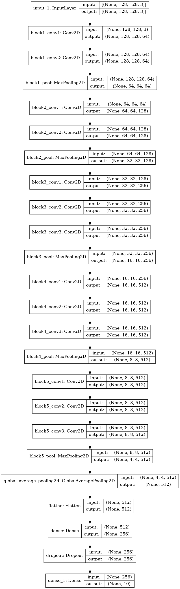
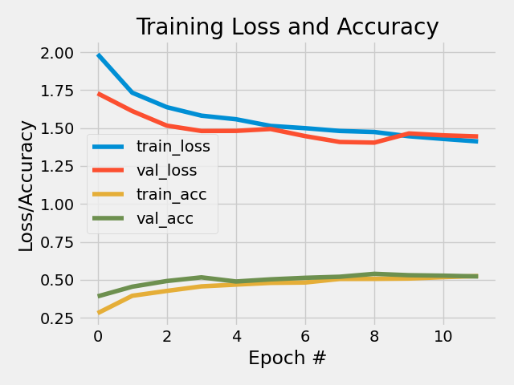
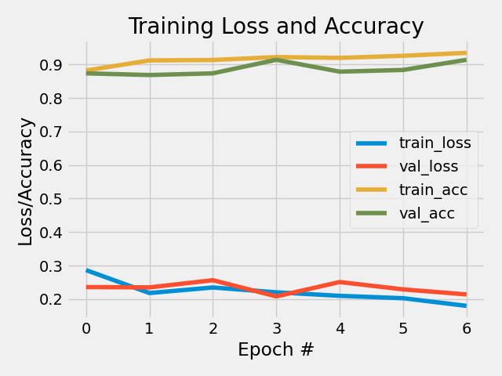

Self-assigned project - Painter Classification
==============================
**Peter Thramkrongart and Jakub Raszka**

##	Github link

Link to the repository: https://github.com/JakubR12/cds-visual-portfolio.git

Link to the asssignment folder: https://github.com/JakubR12/cds-visual-portfolio/tree/main/assignments/final-project

## Contribution

Both Peter Thramkrongart and Jakub Raszka contributed equally to every stage of this project from initial conception and implementation, through the production of the final output and structuring of the repository. (50/50%)

##  Description

This self-assigned project is a continuation of the assignment 5 wherein we were instructed to build a impressionist painter classifier. We failed to meet the goal we set for ourselves of 50 % accuracy so we decided to give it a one more shot and tried to implement the full range of tools and knowledge we have been taught during the semester.
You can find the data for the assignment here: https://www.kaggle.com/delayedkarma/impressionist-classifier-data
Using this data,  we built a deep learning model which classify paintings by their respective artists. Why might we want to do this? Well, consider the scenario where we have found a new, never-before-seen painting which is claimed to be the artist Renoir. An accurate predictive model could be useful here for art historians and archivists!


## Methods

The data were obtained from Kaggle (the link above). It consisted of around 5000 images from 10 different impressionistic artists. 

For this problem we choose to use the Keras ImageDataGenerator() class to load, rescale to 0-1 and resized multiple times to find the best image size. The data generator was further used to create more images by zooming and mirroring the original images. Due to an error in our code, we actually ran all of our models with vertical flipping instead of horizontal flipping. This means that our models trained on upside down images instead of regularly mirrored images. We actually found that our models performed slightly better this way, but due to the "unrealisticness" of this manipulation we chose to correct it at the cost of 1 or 2 % accuracy. The function offers more methods for data augmentation. We chose only the zoom and flip as we reckoned that other methods would result in too artificial and unrealistic images compared to the original ones.

We used the pre-trained VGG16 model without the top dense layer as a feature extractor and trained a neural net classifier on the extracted features. We were inspired by this article (https://xingyuzhou.org/documents/transfer-learning.pdf) in which an outstanding 98 % accuracy was reached in the binary classification between Monet and Van Gogh. 

This was our general model architecture: 



Out of curiosity, we also attempted a binary classification with our model, as we doubt that all artists will be in consideration if a new painting appears. As a baseline we used Monet and Matisse as the classes. We deemed the pair to be the most distinct from each other. We found 128 and 0.3 to be the best image size and dropout values so we used those values for the baseline model as well. Because of the increase in the training time, we used a binary classification to find the best hyper-parameters. We used the best values to run the categorical classification on all painters afterwards.

All of our models were trained using early stopping based on validation loss. Within a patience of three epochs, the weights of the best model were saved.

## Results

Compared to the last time, VGG16 and data augmentation greatly improved model performance. On all ten painters, our best model got around 54% accuracy. Without VGG16 and data augmentation we got an accuracy of around 38%. In our perspective, this alone is enough to render our project a success. 

Our baseline model with Monet-Matisse performed at 90% accuracy. We also consider that rather impressive given how little data the model had to work with.
We also tried to train the model on more similar pairings. We tried with Monet-Pissarro and we found that artist similarity indeed seemed to matter. We could only mange to get around a 75% accuracy. We also tried with Degas and Cezanne whom we deemed to be rather similar, but have different style from the others. That task proved to be rather easy and the model performed with and accuracy of 84%.

Despite our best attempts to make our results generalizable, we found our results to be rather unstable between runs. We often found our results to fluctuate within a range of around 4%. We found an image size to matter to some degree, and we found larger images to perform slightly better at around 89%. On larger images dropout also seemed to matter more, and we settled for a dropout value of 0.3 with the image size 128X128.

Training plot of the 10-class model:




Performance metrics of the 10-class model:

              precision    recall  f1-score   support

    Pissarro       0.42      0.51      0.46        99
      Hassam       0.50      0.65      0.56        99
       Monet       0.44      0.45      0.45        99
       Degas       0.58      0.54      0.55        99
     Matisse       0.63      0.73      0.67        99
     Sargent       0.54      0.56      0.55        99
     Cezanne       0.66      0.53      0.58        99
     Gauguin       0.74      0.35      0.48        99
      Renoir       0.74      0.49      0.59        99
     VanGogh       0.42      0.60      0.49        99
     
    accuracy                            0.54       990
    macro avg       0.57      0.54      0.54       990
    weighted avg    0.57      0.54      0.54       990

Training plot of the main Monet-Matisse model:




Performance metrics of the main Monet-Matisse model:

              precision    recall  f1-score   support

       Monet       0.89      0.94      0.92        99
     Matisse       0.94      0.89      0.91        99

    accuracy                            0.91       198
    macro avg       0.92      0.91      0.91       198
    weighted avg    0.92      0.91      0.91       198


## Reproducibility

**Step 1: Clone repository**  
- open a linux terminal
- Navigate the destination of the repository
- run the following command  
```console
 git clone https://github.com/JakubR12/cds-visual-portfolio.git
```

**Step 2: Get data from Kaggle**
- Follow these instruction on how to get access to the Kaggle API:
https://www.kaggle.com/docs/api
- If you already have API access run these commands in the terminaL:
```console
cd assignments/final-project/data/raw
kaggle datasets download -d delayedkarma/impressionist-classifier-data
unzip impressionist-classifier-data.zip
cd ../..
```

**step 3: Setup the virtual environment:**  
- You can setup the virtual environment by running the _create_cnn_v2_venv.sh_ script and the activate with command below.
```console
bash create_cnn_v2_venv.sh

source cnn_v2_venv/bin/activate
```  

**step 4: Run the script:**  
- You can run the model and adjust its (optional) parameters, we provide our baseline model as an example:

     Input:
    model_name, default: VVG16_artistic_classifier,   description: str,   a name of the model and its corresponding
                                                                          plots and weights,
    epochs:     default: 50,                          description: int,   a number of epochs
    patience:   default: 3,                           description: int,   a number of how many times can a model perform
                                                                        worse than in the previous epoch before it is shut down
    dropout:    default: 0.3,                         description: float, a dropout in the network
    image_size: default: 128,                         description: int,   a number of pixels of the images

    Output:
      In to the "models" folder, following things are saved:
        - report metric
        - plot history
        - model weights
        - model architecture


```console
cd src

python python VGG16_artist.py -is 128 -n "A2B_D3_IS128"
``` 
You can also choose the artists you want to classify. All you need to do is to change the _artists.txt_ file. Every artist should be put on a separate line with no other separator in between. Also make sure that they are no empty lines left. The full list of 10 artists you can pick from can be found in the _all-artists.txt_ file. 

**step 5: Killing the environment:**  
- You can kill the virtual environment by running the _kill_cnn_v2_venv.sh_ script which can be found in the final project folder:
```console
cd ..

bash kill_cnn_v2_venv.sh
```  


## Running the project on something else than Linux
Our projects are mainly made for Linux/mac users. Our python scripts should run on any machine, though our bash scripts may not work. For this case, we recommend using the python distribution system from https://www.anaconda.com/ to setup environments using our requirements.txt files.

Project Organization
------------
The folder structure of our projects are based on a simplified version of the cookiecutter datascience folder structure https://drivendata.github.io/cookiecutter-data-science/. For the sake of generalizability some folders will remain empty for some projects, but overall this will make folder navigation easier.


    ├── LICENSE
    ├── README.md          <- The top-level README for developers using this project.
    ├── data
    │   ├── interim        <- Intermediate data that has been transformed.
    │   ├── processed      <- The final, canonical data sets for modeling.
    │   └── raw            <- The original, immutable data dump.
    │
    ├── models             <- Trained and serialized models, model predictions, or model summaries
    │
    ├── utils              <- utility scripts with reusable functions and classes
    |  └──__init__.py      <- Makes utils a Python module
    |
    ├── notebooks          <- Jupyter notebooks. Naming convention is a number (for ordering),
    │                         the creator's initials, and a short `-` delimited description, e.g.
    │                         `1.0-jqp-initial-data-exploration`.
    │
    ├── references         <- Data dictionaries, manuals, and all other explanatory materials.
    │
    ├── requirements.txt   <- The requirements file for reproducing the analysis environment, e.g.
    │                         generated with `pip freeze > requirements.txt`
    │
    └── src                <- Source code for use in this project.
      └── __init__.py    <- Makes src a Python module
    


